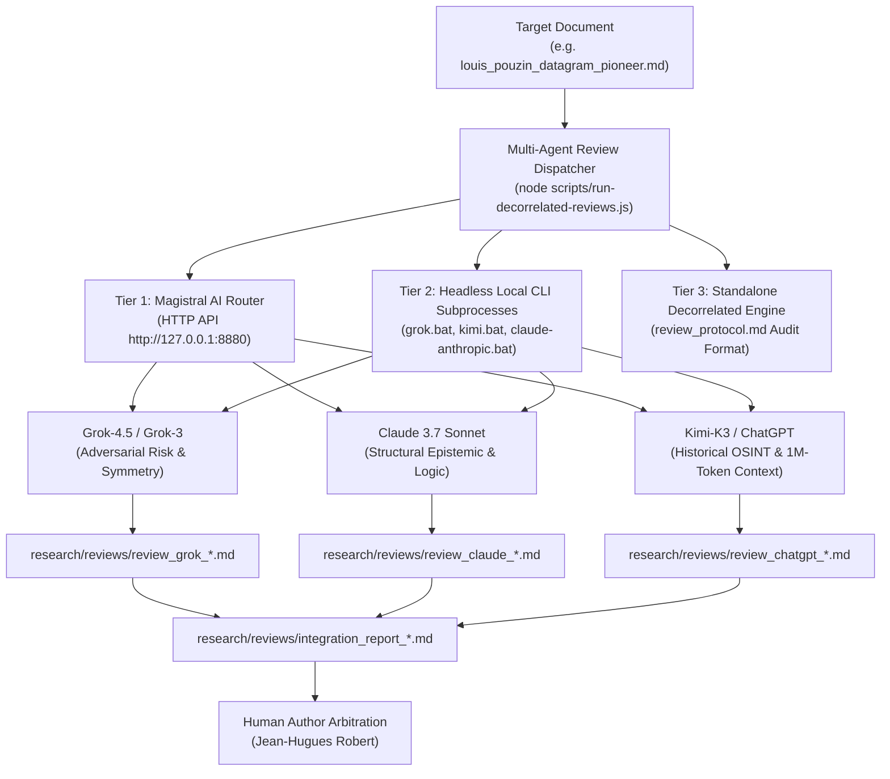

# Multi-Agent Decorrelated Adversarial Review Engine Master Plan 📜🤖🛡️
**Architectural Blueprint for Multi-Model Adversarial Audits & Local CLI Router Interoperability**

> **Goal**: Establish a robust, multi-agent decorrelated review pipeline (`node scripts/run-decorrelated-reviews.js`) that enforces the *Protocole Minimal de Revue Ciblée* ([`review_protocol.md`](https://github.com/JeanHuguesRobert/barons-Mariani/blob/main/research/review_protocol.md)). This pipeline dispatches paper drafts to independent AI models (**Grok**, **Claude**, **Kimi**, **ChatGPT**) via both local CLI launchers (`grok.bat`, `kimi.bat`, `claude-anthropic.bat`) and the **Magistral AI Router Boundary**, collecting standalone 9-point critique files and serving a Human Decision Integration Report for author arbitration.

---

## 🏛️ Architecture Overview



---

## 📋 4-Phase Implementation Breakdown

### Phase 1: Review Protocol Enforcement & Artifact Separation
- **Objective**: Ensure that papers remain pure source documents (`source.md`) and that critiques are generated as separate, un-merged standalone files.
- **Deliverables**:
  - `barons-Mariani/research/reviews/review_grok_<doc>.md`
  - `barons-Mariani/research/reviews/review_claude_<doc>.md`
  - `barons-Mariani/research/reviews/review_chatgpt_<doc>.md`
  - `barons-Mariani/research/reviews/integration_report_<doc>.md`

---

### Phase 2: Local CLI Launcher Interoperability
- **Objective**: Enable non-interactive execution of local AI command-line launchers installed on the workstation.
- **Launcher Suite**:
  - 🤖 `grok.bat` (`xai/grok-4.5`)
  - 🌙 `kimi.bat` (`moonshotai/Kimi-K3` - 1M token context)
  - 🧠 `claude-anthropic.bat` / `claude-zai.bat` (`anthropic/claude-3-7-sonnet`)
  - ♊ `gemini.bat` (`google/gemini-1.5-pro`)
  - 🔮 `glm.bat` / `muse.bat`
- **Execution Mechanism**: Non-interactive `execFileSync` wrapper passing review prompts with proper stdin handling to avoid TTY raw mode errors.

---

### Phase 3: Magistral AI Router Boundary Integration
- **Objective**: Connect to the Magistral AI Router (`http://127.0.0.1:8880`) when active, leveraging unified OpenAI-compatible chat completion endpoints (`/v1/chat/completions`).
- **Features**: Zero-secret header sanitization, model capability routing, and automatic RAG context packing fallback.

---

### Phase 4: Rossignol Test & Human Decision Integration
- **Objective**: Enforce the Rossignol Test (*Pas de stabilisateur sans Rossignol*) and present an un-biased Integration Table to the human author.
- **Rules**:
  - The AI agents are non-decision-making reviewers.
  - Final plateau status (`release_candidate` / `published`) belongs exclusively to the human author (**Jean-Hugues Robert**).
  - Rossignol execution test scripts (`scripts/test-cognitive-datagram.js`) must validate empirical grounding.

---

## 🛠️ CLI & MCP Interface

### CLI Command
```bash
node scripts/run-decorrelated-reviews.js [--file <path>] [--use-local-launchers] [--router-url http://127.0.0.1:8880]
```

### MCP Tool Integration
Expose `cogentia_run_decorrelated_review` in `scripts/lib/cogentia-mcp-core.js` so any MCP client agent can trigger multi-agent decorrelated reviews!

---

## 🧪 Verification Matrix

| Step | Verification Criteria | Expected Outcome |
|---|---|---|
| **1. Artifact Separation** | File system check under `research/reviews/` | 3 separate review files + 1 integration report |
| **2. Local CLI Launchers** | `execFileSync` on local `.bat` launchers | Clean non-interactive model execution |
| **3. Magistral Router** | HTTP check on `http://127.0.0.1:8880` | Clean chat completions with zero secret leaks |
| **4. Human Arbitration** | `integration_report_*.md` generation | Unfilled decision table reserved for human author |
