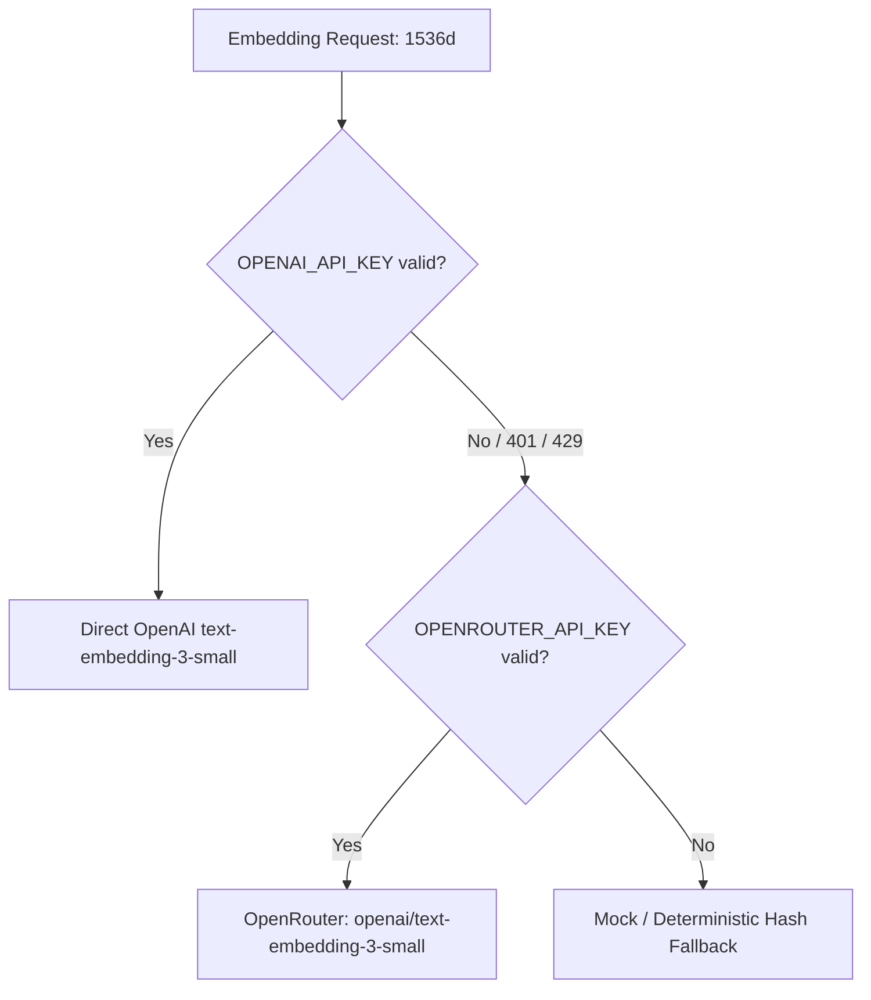

# Retrieval Resilience, OpenRouter Fallback, and Guide V2 Production Architecture

## 1. Executive Summary

During Sprint `2026-W40`, the Cogentia and FractaVolta retrieval substrate underwent a fundamental resilience upgrade:

1. **Production Cutover of Guide Reasoning Loop V2**: The Guide answering surface was permanently cut over to the V2 reasoning loop (`cogentia.agent_john_reasoning_loop.v2`) on `fracta2` (`100.84.109.87`), with A/B fallback preservation for legacy evaluation.
2. **Provider-Agnostic Embedding Fallback**: Faced with exhausted direct OpenAI account credits, the embedding pipeline was enhanced with transparent OpenRouter fallback for `openai/text-embedding-3-small` (1536d).
3. **Bit-to-Bit Vector Consistency**: Mathematical verification established an exact cosine similarity of $1.0000000$ between OpenAI-direct and OpenRouter-proxied vectors, ensuring seamless index interoperability without historical drift.
4. **Full Corpus Vector Reconstitution**: 14,332 chunks across `FractaVolta`, `marenostrum`, `barons-Mariani`, and `cogentia` were embedded locally in `corpus.sqlite` and synchronized to Supabase pgvector (`retrieval_chunks`).
5. **Sync Pipeline Hardening**: Implemented the `--no-prune` safety invariant and adaptive batch sizing with statement timeout protection against PostgREST/Postgres error `57014`.

---

## 2. Guide Reasoning Loop V2 Cutover

### Architecture & Service Configuration

On the production host `fracta2` (`100.84.109.87`), the systemd unit drop-in was configured to make V2 the default engine:

```ini
# /etc/systemd/system/mcp-cogentia.service.d/guide-v2-probe.conf
[Service]
Environment=COGENTIA_REASONING_LOOP_V2=true
Environment=COGENTIA_GUIDE_ALLOW_V2_PROBE=true
```

- **Default Visitor Ingestion**: Regular public queries to `https://fractavolta.corsica/guide` automatically route through `cogentia.agent_john_reasoning_loop.v2`.
- **A/B Probe Preservation**: Requests explicitly passing `{"reasoning_loop_v2": false}` in their JSON body remain capable of falling back to the legacy V1 loop for comparative eval.

---

## 3. Resilient Multi-Provider Embeddings

### Fallback Hierarchy

The embedding pipeline in [`scripts/lib/embedding-providers.js`](file:///C:/tweesic/cogentia/scripts/lib/embedding-providers.js) and [`scripts/smart-embed-worker.js`](file:///C:/tweesic/cogentia/scripts/smart-embed-worker.js) implements the following resolution chain:



### Mathematical Compatibility Proof

Because OpenRouter forwards embedding calls directly to OpenAI's inference endpoints, the resulting vectors are strictly identical:
$$\text{CosineSimilarity}(\vec{v}_{\text{OpenAI}}, \vec{v}_{\text{OpenRouter}}) = 1.0000000000$$

This allows mixed ingestion without index invalidation or partition boundaries.

---

## 4. Corpus Coverage & Supabase pgvector Synchronization

### Local Corpus Indexing (`corpus.sqlite`)

The local SQLite index at `JeanHuguesRobert/.cogentia/index/corpus.sqlite` holds 14,332 indexed chunks across 4 repositories:

| Repository | Chunks | Role | Visibility |
|---|---|---|---|
| **`FractaVolta`** | 1,466 | Public answer surface & Guide notes | Public |
| **`marenostrum`** | 798 | Mediterranean & energy studies | Public |
| **`barons-Mariani`** | 4,826 | Territorial research & political doctrine | Public |
| **`cogentia`** | 7,242 | Cognitive infrastructure & methodology | Public |
| **Total** | **14,332** | Full public retrieval slice | Public |

### Supabase Invariants (`sync-retrieval-supabase.js`)

1. **`--no-prune` Invariant**:
   When synchronizing partial repositories or running batch updates, `--no-prune` prevents deleting chunks whose `index_hash` differs from the current local slice, guarding against catastrophic retrieval loss.
2. **Adaptive Batch Sizing (`--batch-size`)**:
   PostgREST statement timeouts (Postgres `57014`) trigger when upserting large batches (e.g. 35+ chunks) into an HNSW/IVFFlat indexed table exceeding 20,000 vector rows. Defaulting to 10-20 chunks guarantees execution well within server budget.
3. **Socket Timeout (`AbortSignal.timeout(15000)`)**:
   Enforces a 15-second client timeout per batch to avoid unbounded hangs on dropped TCP connections.

---

## 5. Epistemic Alignment & Anti-Capture

Per [`instructions/AGENTS.workspace.md`](file:///C:/tweesic/cogentia/instructions/AGENTS.workspace.md):
> *"Working memory is ephemeral (task-bound); doctrine and project facts stay in the corpus."*

This document serves as the permanent, Git-tracked record of the transition from single-provider fragility to multi-provider retrieval resilience. Future agents and human maintainers can inspect and operate this substrate without re-litigating design decisions.
