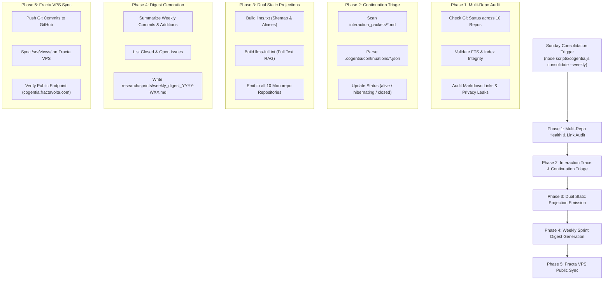

# Sunday Corpus Consolidation Master Plan 📜🧘‍♂️
**Architectural Blueprint for Automated Weekly Corpus De-Entropy & Sprint Wrap-Up**

> **Goal**: Automate the weekly Sunday Corpus Consolidation workflow via a single CLI command (`node scripts/cogentia.js consolidate --weekly`) and MCP tool (`cogentia_consolidate_weekly`). This pipeline scans all 10 monorepo repositories, audits index health, triages continuations and interaction traces, and always emits **two privacy domains**:
>
> | Domain | Artifacts | Contents |
> |--------|-----------|----------|
> | **PUBLIC** (publishable) | `research/sprints/weekly_digest_YYYY-WXX.md`, root `llms.txt` / `llms-full.txt` (fan-out to public repos) | Public repos & commits only; no private repo names as inventory entries; no local Downloads |
> | **PRIVATE** (workspace-only) | `.cogentia/sprints/weekly_digest_full_YYYY-WXX.md`, `.cogentia/projections/llms*.txt` | All repositories, including private ones; high-signal Downloads; never fan-out to public roots |
>
> Private repositories (`visibility: private`) never leak into public digests or public `llms.txt`. Optional Phase 5 synchronizes Fracta VPS **public** views only.

---

## 🏛️ Architecture Overview



---

## 📋 5-Phase Implementation Breakdown

### Phase 1: Multi-Repo Health & Link Audit
- **Objective**: Ensure every repository declared by the local monorepo inventory is clean, indexed, and free of broken links or private data leaks.
- **Components**:
  - `gitVerifyCore()` status check.
  - Index status check (`indexStatusCore()`).
  - Privacy and public leakage check (`corpus privacy`).

---

### Phase 2: Interaction Trace & Continuation Triage
- **Objective**: Consolidate loose interaction traces and active continuations into a structured state.
- **Components**:
  - `syncInteractionTracesCore()` scanning `interaction_packets/*.md` (22 trace packets).
  - Triage open continuations into `alive`, `hibernating`, or `resolved`.
  - Package resolved continuations for historical archive.

---

### Phase 3: Dual Static Projection Emission
- **Objective**: Re-generate and distribute fresh sitemaps and RAG projections across the entire monorepo.
- **Components**:
  - `emitStaticProjection(ctx)` emitting:
    - `llms.txt`: Annotated sitemap for 1-hop alias navigation.
    - `llms-full.txt`: Full-text concatenation of canonical specifications.
  - Distribute both files to the root of **all 10 tracked repositories**.

---

### Phase 4: Weekly Sprint Digest Generation (`weekly_digest_YYYY-WXX.md`)
- **Objective**: Produce a clean, structured Markdown executive summary report documenting the week's progress.
- **Output File**: `research/sprints/weekly_digest_YYYY-WXX.md` (e.g. `research/sprints/weekly_digest_2026-W30.md`).
- **Sections**:
  1. **Executive Summary**: Overview of sprint accomplishments.
  2. **Corpus Additions & Updates**: New files, modified specs, commit count per repo.
  3. **GitHub Issue Status**: Closed issues vs. active open issues.
  4. **Active Continuations & Next Sprint Focus**: Carry-over continuations for next week.

---

### Phase 5: Fracta VPS Public Sync & Verification
- **Objective**: Synchronize public deployment on Fracta VPS so the web twin is 100% up to date.
- **Components**:
  - Git push to GitHub (`main` branch).
  - Sync `/srv/views/` and `llms.txt` / `llms-full.txt` on Fracta VPS via SSH.
  - Verify live HTTP health check at `https://cogentia.fractavolta.com/llms.txt`.

---

## 🛠️ CLI & MCP Tool Interface

### CLI Command
```bash
node scripts/cogentia.js consolidate --weekly [--at ISO-8601] [--json] [--push-vps]
```

`--at` replays the digest window ending at an explicit timestamp. It is used
for a deterministic correction of a prior sprint: both the sprint tag and the
seven-day Git history window derive from that timestamp.

### MCP Tool Definition (`cogentia_consolidate_weekly`)
Exposes `cogentia_consolidate_weekly` tool in `scripts/lib/cogentia-mcp-core.js` so AI client agents (Antigravity, Cursor, Claude Desktop) can trigger Sunday Consolidation directly via MCP!
