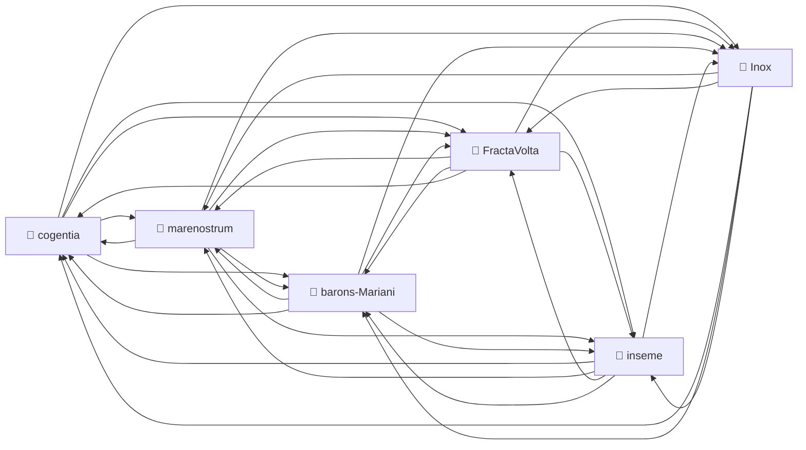

# Corpus Status — cogentia

<!-- BEGIN_AUTO: trails -->
> 🧭 **Trail: From Autonomia to DHITL**
> ⬅️ Previous: [Infrastructure is All You Need](https://github.com/JeanHuguesRobert/marenostrum/blob/main/infrastructure_is_all_you_need.md) | ➡️ Next: [Research Index — Cogentia](index.md)

> 🧭 **Trail: From Method to Machine**
> ⬅️ Previous: [The Sovereign Digital Twin: Cogentia, Cogentigram, Cogentiscope](cogentia-digital-twin.md) | ➡️ Next: [Research Index — Cogentia](index.md)

<!-- END_AUTO: trails -->

*Auto-refreshed by `cogentia.js corpus-status`. The structural sections* —
*Registered Repositories, Cross-Reference Graph, Published, What Remains Possible* —
*are regenerated from the registry and from [`research/index.md`](index.md) on every run.*
*The substantive sections* — *What Is Proved* *and* *Open Objections* —
*are manually curated and preserved across refreshes.*

---

## Registered Repositories

<!-- BEGIN_AUTO: registered_repos -->
| Repository | research/index.md | Branch | Last commit |
|---|---|---|---|
| cogentia | ✅ | main | 2026-05-27 |
| FractaVolta | ✅ | main | 2026-05-27 |
| marenostrum | ✅ | main | 2026-05-27 |
| barons-Mariani | ✅ | main | 2026-05-27 |
| inseme | ✅ | main | 2026-05-27 |
| Inox | ✅ | master | 2026-05-27 |
<!-- END_AUTO: registered_repos -->

---

## Cross-Reference Graph

<!-- BEGIN_AUTO: graph -->

<!-- END_AUTO: graph -->

---

## Concepts

<!-- BEGIN_AUTO: concepts -->
| Concept | Scope | Status | Type |
|---|---|---|---|
| [Cogentia](./concepts.md#cogentia) | Global | Working | abstract concept / agentivity class |
| [Cogentigram](./concepts.md#cogentigram) | Global | Working | representation / map |
| [Continuation Protocol](./concepts.md#continuation-protocol) | Global | Operational | protocol |
| [Cognitive Packet](./concepts.md#cognitive-packet) | Global | Defined | protocol / envelope+payload format |
| [Cogentia Commons](./concepts.md#cogentia-commons) | Global | Canonical | methodology |
| [Cogentia Pipeline](./concepts.md#cogentia-pipeline) | Global | Defined | methodology / packet-based transformation network |
| [Derived Product](./concepts.md#derived-product) | Global | Defined | editorial form / publication mode |
| [Sovereign Digital Twin](./concepts.md#sovereign-digital-twin) | Global | Defined | system model |
| [Agent-Resumable CLI](./concepts.md#agent-resumable-cli) | Global | Operational | architecture |
| [Kernel Extractor](./concepts.md#kernel-extractor) | repository-specific | Working | mechanism |
| [KYS (Know Your System) / Psychocognitive Analysis](./concepts.md#kys-know-your-system-psychocognitive-analysis) | project-specific | Working | protocol |
| [Cogentia Workflows](./concepts.md#cogentia-workflows) | repository-specific | Defined | system model |
<!-- END_AUTO: concepts -->

## Concept Graph

```mermaid
graph LR
  c_cogentia["Cogentia"]
  c_cogentigram["Cogentigram"]
  c_continuation_protocol["Continuation Protocol"]
  c_cogentia_commons["Cogentia Commons"]
  c_sovereign_digital_twin["Sovereign Digital Twin"]
  c_agent_resumable_cli["Agent-Resumable CLI"]
  c_kernel_extractor["Kernel Extractor"]
  c_kys_know_your_system_psychocognitive_analysis["KYS (Know Your System) / Psychocognitive Analysis"]
  c_cogentia_workflows["Cogentia Workflows"]
  c_cogentia["Cogentia"]
  c_cogentigram["Cogentigram"]
  c_ipn_inference_packet_network["IPN (Inference Packet Network)"]
  c_epn_energy_packet_network["EPN (Energy Packet Network)"]
  c_pgn_power_generation_node["PGN (Power Generation Node)"]
  c_packet_attractors["Packet Attractors"]
  c_the_unconscious_grid["The Unconscious Grid"]
  c_mariani_village["Mariani Village"]
  c_value_shaped_solar["Value-Shaped Solar"]
  c_containerized_compute_tera["Containerized Compute (Tera)"]
  c_traceable_governance["Traceable Governance"]
  c_cogentia["Cogentia"]
  c_cogentigram["Cogentigram"]
  c_dhitl_democratic_human_in_the_loop["DHITL (Democratic Human In The Loop)"]
  c_cxu_compute_and_exergy_unit["CXU (Compute and Exergy Unit)"]
  c_safe_compute_exergy["Safe Compute Exergy"]
  c_constellia["Constellia"]
  c_corsica_forest_synergies["Corsica Forest Synergies"]
  c_infrastructure_is_all_you_need["Infrastructure is All You Need"]
  c_sun_to_sovereignty["Sun to Sovereignty"]
  c_cogentia["Cogentia"]
  c_cogentigram["Cogentigram"]
  c_potentics["Potentics"]
  c_cognitive_waves["Cognitive Waves"]
  c_mimetic_desynchronization["Mimetic Desynchronization"]
  c_invidia["Invidia"]
  c_transition_markets["Transition Markets"]
  c_the_uchronian_museum["The Uchronian Museum"]
  c_possibilism["Possibilism"]
  c_territoires_possibilistes["Territoires Possibilistes"]
  c_the_second_method["The Second Method"]
  c_projet_minesteggio["Projet Minesteggio"]
  c_discret_holography["Discret Holography"]
  c_cogentia["Cogentia"]
  c_cogentigram["Cogentigram"]
  c_cop_continuous_operation_protocol["COP (Continuous Operation Protocol)"]
  c_briques["Briques"]
  c_kudocracy["Kudocracy"]
  c_agora["Agora"]
  c_ophelia["Ophélia"]
  c_cop_invariants["COP Invariants"]
  c_brique_spec_multi_instance["Brique Spec / Multi-Instance"]
  c_modular_system["Modular System"]
  c_traceable_agency["traceable agency"]
  c_traceable_agency --> c_cogentia
  c_cogentia --> c_cogentigram
  c_operational_memory["operational memory"]
  c_cogentia --> c_operational_memory
  c_map_vs_territory["map vs territory"]
  c_cogentigram -.-> c_map_vs_territory
  c_cogentigram -.-> c_operational_memory
  c_cogentigram -.-> c_traceable_agency
  c_agent_resumable_cli --> c_continuation_protocol
  c_dhitl["dhitl"]
  c_dhitl --> c_infrastructure_is_all_you_need
```

<!-- BEGIN_AUTO: concept_graph -->

<!-- END_AUTO: concept_graph -->

---

## Published in this repo

<!-- BEGIN_AUTO: published -->
| Title | Location | Date |
|---|---|---|
| [**Cogentia — the framework, in five distinctive moves**](../COGENTIA.md) *(identity document; entry point)* | this repo | 2026-05-13 |
| [Agent-Resumable CLI — Externalized Judgment, Continuations, and Provider-Neutral Resumption for AI-Compatible CLI Tools](agent_resumable_cli.md) *(defines `cogentia.continuation.v1`, implemented by `scripts/cogentia.js continuation`)* | this repo | 2026-05-14 |
| [Cognitive Packets — An Envelope and Payload Format for Human–AI and Multi-Agent Cooperation](cognitive_packets.md) *(working paper v0.3 — envelope/payload split ; paired operational prompt in [`prompts/cognitive_packet.md`](../prompts/cognitive_packet.md))* | this repo | 2026-05-21 |
| [Pipeline — From cognitive packets to source documents and derived products](pipeline.md) *(method note v0.4 — packet-switched, self-applicative; canonical operational method of the corpus)* | this repo | 2026-05-25 |
| [Derived Products — Versioned Source Corpora, Situated Forms, and Publication Agents](derived_products.md) *(working paper v0.2 — source ↔ derived split; companion to [`pipeline.md`](pipeline.md))* | this repo | 2026-05-23 |
| [cogentia.js — Tutorial and Near-Specification](cogentia_js_tutorial.md) *(auto-generated tutorial v0.1 — core ideas, storage model, 14 workflows, command reference for v0.10.0; sufficient for a faithful re-implementation in another language)* | this repo | 2026-05-27 |
| [Self-Contained Documents in an Interconnected Corpus](self_contained_documents.md) *(method note v0.3 — formalises the auto-portance principle: a document may cite/extend/transform other texts, but its main claims remain assessable without prior external reading; emerged from work on `traceabilite_des_actes`)* | this repo | 2026-05-27 |
| [Cogentia Workflows](cogentia_workflows.md) *(private/group/public/federated workflow architecture, draft v0.2)* | this repo | 2026-05-11 |
| [Cogentia Commons Working Paper](Cogentia_Commons_Working_Paper.md) | this repo | 2026 |
| [Cogentia and Cogentigram](Cogentia-and-Cogentigram.md) | this repo | 2026 |
| [The Sovereign Digital Twin — Cogentia, Cogentigram, Cogentiscope](cogentia-digital-twin.md) | this repo | 2026-04 |
| [Democratic AI Safety — alias](democratic_ai_safety.md) *(canonical in barons-Mariani; this file is now a stub)* | this repo | 2026-05-18 |
| [KYS — Psychocognitive Analysis Protocol v1.0](kys-prompt.md) | this repo | 2026 |
| [COGENTIA v1.0 — Prompt d'analyse psychocognitive (FR)](cogentia_prompt_v1.md) | this repo | 2026 |
| [Corpus Status](corpus-status.md) *(living view — auto-refreshed by `cogentia.js corpus-status`)* | this repo | refreshable |
| [Concept Index](concepts.md) *(typed concept registry — mapped by `cogentia.js concepts`)* | this repo | refreshable |
| [Agent Navigation Guide (Context Server)](../docs/agent_context_server.md) *(meta-prompt for AI agents — bundle, query, continuation)* | this repo | 2026-05-16 |
| [The Knowledge Mesh (Decentralized Wiki)](../docs/knowledge_mesh.md) *(backlinks, trails, Jekyll — human navigation guide)* | this repo | 2026-05-16 |
| [Trail — From Method to Machine](trails/from_method_to_machine.md) *(curated reading path for newcomers — technical / cognitive infrastructure entry)* | this repo | 2026-05 |
| [Trail — From Autonomia to DHITL](trails/from_autonomia_to_dhitl.md) *(curated reading path for the political / territorial entry into the Democratic AI Safety thesis)* | this repo | 2026-05-18 |
<!-- END_AUTO: published -->

---

## What Is Proved

*Manually curated: claims demonstrated by the published work in this corpus.*

| Claim | Status | Evidence |
|---|---|---|
| Cogentia Commons MVP is fully specifiable as a coherent set of contracts | ✅ Demonstrated | 7 research documents totalling ~4500 lines: [MVP spec](cogentia_commons_mvp_spec.md) v0.10.2 + [COMMUNITY.md sub-spec](cogentia_commons_community_manifest.md) v0.2 + 3 plugin sub-specs + [workflows](cogentia_commons_workflows.md) + [continuation snapshot](cogentia_commons_continuation.md) |
| The CLI face of Cogentia Commons (`cogentia.js`) is operational with 18 commands | ✅ Operational | `scripts/cogentia.js` v0.4.0; see `cogentia.js manifest --json` for the live tool surface |
| Rule 4 ("let the corpus be its own evidence") runs in practice | ✅ Demonstrated | `cogentia.js scan` surfaced a real uncatalogued working paper on 2026-05-13 ([`cogentia_workflows.md`](cogentia_workflows.md)); gap closed by `cogentia.js ref` + index.md edit; this very file is auto-refreshed evidence |
| The 6-repo network is structurally symmetric | ✅ Verified | `cogentia.js graph` shows complete K6 (30 directed cross-references) since 2026-05-26 when Inox was added to every other repo's *Referenced* section; see *Cross-Reference Graph* above |
| Every research document carries its own canonical URL | ✅ Demonstrated | 71+ files stamped with `canonical_url:` in YAML front-matter via `cogentia.js stamp --all` |
| Cogentia Commons can ship as an inseme brique | 🔄 Specified, implementation pending | [MVP spec §12](cogentia_commons_mvp_spec.md) maps the brique deployment in detail; `@inseme/brique-cogentia-commons` package not yet created |
| The CLI is AI-agent-bindable as an OpenAI tool palette | ✅ Demonstrated | `cogentia.js manifest --json` returns OpenAI-compatible `tools[]` with parameters + side_effects; same shape as `brique-actes/brique.config.js` tools array |
| AI-agent state changes can leave a signed reasoning trail | ✅ Demonstrated | `.cogentia/audit.jsonl` captures `--narrative-short`, `--narrative-long`, `--chat-url` per state-changing operation; this very corpus-status refresh is in the log |

---

## Open Objections

*Manually curated: objections received publicly, not yet fully resolved.*

| Objection | Source | Status |
|---|---|---|
| `cogentia.js scan` uses substring-basename matching, not proper markdown link parsing | self-audit (`cogentia_js_doctrine.md` memory + this session) | 🔄 Known doctrinal gap; `.cogentiaignore` works around it but does not replace the principled fix (Rule 4) |
| Brique `@inseme/brique-cogentia-commons` is specified but not implemented | MVP spec §12 (own roadmap) | ❌ Implementation has not started; specs are the deliverable |
| Corpus remains solo-authored — fractal claim unverified at scale | inherited from [`second_method.md`](https://github.com/JeanHuguesRobert/barons-Mariani/blob/main/research/second_method.md) §"Conditions of Failure" | ❌ Structural — invitation to fork is open, no external forks yet |
| Multi-owner stewardship of `COMMUNITY.md` is single-Founder in v1 | COMMUNITY.md sub-spec §10.1 | 🔄 Named, deferred to v1.1 |
| Retrofit / proxied actors workflow is sketched, schema is reserved, but full protocol is post-v1 | MVP spec §1.4 + Workflow #11 | 🔄 Deliberately deferred; v1 schema honours the future without implementing it |

---

## What Remains Possible

<!-- BEGIN_AUTO: possibilities -->
- Cogentia Commons as methodology for any distributed peer-review process
- Cogentigram as visual language for knowledge graph navigation
- PrivAI governance model — from non-profit to cooperative structure
<!-- END_AUTO: possibilities -->

---

*Generated with `cogentia.js corpus-status` — [scripts/cogentia.js](https://github.com/JeanHuguesRobert/cogentia/blob/main/scripts/cogentia.js)*
*Challenge via issues. Fork to explore alternatives.*

<!-- BEGIN_AUTO: backlinks -->
### Backlinks

*These documents link to this file:*
- [Cogentia](../COGENTIA.md)
- [Agent Navigation Guide (Context Server)](../docs/agent_context_server.md)
- [Frontmatter Schema — v0.1 (Corpus)](../docs/frontmatter-schema.md)
- [Frontmatter Synonym Mapping — v0.1](../docs/frontmatter-synonym-mapping.md)
- [The Knowledge Mesh (Decentralized Wiki)](../docs/knowledge_mesh.md)
- [Agent-Resumable CLI](agent_resumable_cli.md)
- [Cogentia Commons — COMMUNITY.md Sub-Specification](cogentia_commons_community_manifest.md)
- [Cogentia Commons — Session Continuation Snapshot](cogentia_commons_continuation.md)
- [Cogentia Commons — MVP Specification](cogentia_commons_mvp_spec.md)
- [Cogentia Commons — Workflows](cogentia_commons_workflows.md)
- [Cogentia Commons: A Platform Architecture for Collaborative Possibility Exploration Under Scientific Constraint](Cogentia_Commons_Working_Paper.md)
- [cogentia.js — Tutorial and Near-Specification](cogentia_js_tutorial.md)
- [COGENTIA v1.0 — Prompt d'analyse psychocognitive](cogentia_prompt_v1.md)
- [Cogentia Workflows](cogentia_workflows.md)
- [Cogentia and Cogentigrams](Cogentia-and-Cogentigram.md)
- [The Sovereign Digital Twin: Cogentia, Cogentigram, Cogentiscope](cogentia-digital-twin.md)
- [Cognitive Packets](cognitive_packets.md)
- [Concept Index — cogentia](concepts.md)
- [Corpus Status — cogentia](corpus-status.md)
- [Democratic AI Safety — alias cogentia](democratic_ai_safety.md)
- [Derived Products](derived_products.md)
- [Research Index — Cogentia](index.md)
- [kys-prompt.md](kys-prompt.md)
- [Pipeline](pipeline.md)
- [Self-Contained Documents in an Interconnected Corpus](self_contained_documents.md)
- [Trail: From Autonomia to DHITL](trails/from_autonomia_to_dhitl.md)
- [Trail: From Method to Machine](trails/from_method_to_machine.md)

<!-- END_AUTO: backlinks -->
