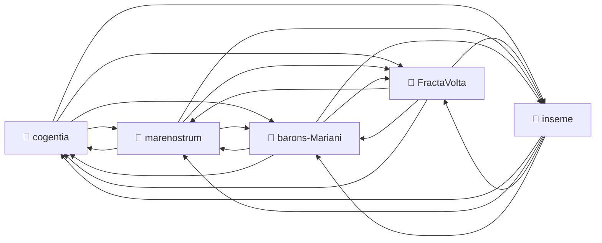

# Corpus Status — cogentia

*Auto-refreshed by `cogentia.js corpus-status`. The structural sections* —
*Registered Repositories, Cross-Reference Graph, Published, What Remains Possible* —
*are regenerated from the registry and from `research/index.md` on every run.*
*The substantive sections* — *What Is Proved* *and* *Open Objections* —
*are manually curated and preserved across refreshes.*

---

## Registered Repositories

<!-- BEGIN_AUTO: registered_repos -->
| Repository | research/index.md | Branch | Last commit |
|---|---|---|---|
| cogentia | ✅ | main | 2026-05-13 |
| FractaVolta | ✅ | main | 2026-05-13 |
| marenostrum | ✅ | main | 2026-05-13 |
| barons-Mariani | ✅ | main | 2026-05-13 |
| inseme | ✅ | master | 2026-05-13 |
<!-- END_AUTO: registered_repos -->

---

## Cross-Reference Graph

<!-- BEGIN_AUTO: graph -->

<!-- END_AUTO: graph -->

---

## Published in this repo

<!-- BEGIN_AUTO: published -->
| Title | Location | Date |
|---|---|---|
| [Cogentia Workflows](cogentia_workflows.md) *(private/group/public/federated workflow architecture, draft v0.2)* | this repo | 2026-05-11 |
| [Cogentia Commons Working Paper](Cogentia_Commons_Working_Paper.md) | this repo | 2026 |
| [Cogentia and Cogentigram](Cogentia-and-Cogentigram.md) | this repo | 2026 |
| [The Sovereign Digital Twin — Cogentia, Cogentigram, Cogentiscope](cogentia-digital-twin.md) | this repo | 2026-04 |
| [Radical Democracy as the Best AI Safety Strategy](democratic_ai_safety.md) | this repo | 2026-05-04 |
| [KYS — Psychocognitive Analysis Protocol v1.0](kys-prompt.md) | this repo | 2026 |
| [COGENTIA v1.0 — Prompt d'analyse psychocognitive (FR)](cogentia_prompt_v1.md) | this repo | 2026 |
| [Corpus Status](corpus-status.md) *(living view — auto-refreshed by `cogentia.js corpus-status`)* | this repo | refreshable |
<!-- END_AUTO: published -->

---

## What Is Proved

*Manually curated: claims demonstrated by the published work in this corpus.*

| Claim | Status | Evidence |
|---|---|---|
| Cogentia Commons MVP is fully specifiable as a coherent set of contracts | ✅ Demonstrated | 7 research documents totalling ~4500 lines: [MVP spec](cogentia_commons_mvp_spec.md) v0.10.2 + [COMMUNITY.md sub-spec](cogentia_commons_community_manifest.md) v0.2 + 3 plugin sub-specs + [workflows](cogentia_commons_workflows.md) + [continuation snapshot](cogentia_commons_continuation.md) |
| The CLI face of Cogentia Commons (`cogentia.js`) is operational with 18 commands | ✅ Operational | `scripts/cogentia.js` v0.4.0; see `cogentia.js manifest --json` for the live tool surface |
| Rule 4 ("let the corpus be its own evidence") runs in practice | ✅ Demonstrated | `cogentia.js scan` surfaced a real uncatalogued working paper on 2026-05-13 ([`cogentia_workflows.md`](cogentia_workflows.md)); gap closed by `cogentia.js ref` + index.md edit; this very file is auto-refreshed evidence |
| The four-repo (now 5-repo) network is structurally symmetric | ✅ Verified | `cogentia.js graph` shows complete K5 (20 directed cross-references); see *Cross-Reference Graph* above |
| Every research document carries its own canonical URL | ✅ Demonstrated | 71+ files stamped with `canonical_url:` in YAML front-matter via `cogentia.js stamp --all` |
| Cogentia Commons can ship as an inseme brique | 🔄 Specified, implementation pending | [MVP spec §12](cogentia_commons_mvp_spec.md) maps the brique deployment in detail; `@inseme/brique-cogentia-commons` package not yet created |
| The CLI is AI-agent-bindable as an OpenAI tool palette | ✅ Demonstrated | `cogentia.js manifest --json` returns OpenAI-compatible `tools[]` with parameters + side_effects; same shape as `brique-actes/brique.config.js` tools array |
| AI-agent state changes can leave a signed reasoning trail | ✅ Demonstrated | `.cogentia/audit.jsonl` captures `--narrative-short`, `--narrative-long`, `--chat-url` per state-changing operation; this very corpus-status refresh is in the log |

---

## Open Objections

*Manually curated: objections received publicly, not yet fully resolved.*

| Objection | Source | Status |
|---|---|---|
| `cogentia.js scan` uses substring-basename matching, not proper markdown link parsing | self-audit (`cogentia_js_doctrine.md` memory + this session) | 🔄 Known doctrinal gap; `.cogentiaignore` works around it but does not replace the principled fix (Rule 4) |
| Brique `@inseme/brique-cogentia-commons` is specified but not implemented | MVP spec §12 (own roadmap) | ❌ Implementation has not started; specs are the deliverable |
| Corpus remains solo-authored — fractal claim unverified at scale | inherited from `second_method.md` §"Conditions of Failure" | ❌ Structural — invitation to fork is open, no external forks yet |
| Multi-owner stewardship of `COMMUNITY.md` is single-Founder in v1 | COMMUNITY.md sub-spec §10.1 | 🔄 Named, deferred to v1.1 |
| Retrofit / proxied actors workflow is sketched, schema is reserved, but full protocol is post-v1 | MVP spec §1.4 + Workflow #11 | 🔄 Deliberately deferred; v1 schema honours the future without implementing it |

---

## What Remains Possible

<!-- BEGIN_AUTO: possibilities -->
- Cogentia Commons as methodology for any distributed peer-review process
- Cogentigram as visual language for knowledge graph navigation
- PrivAI governance model — from non-profit to cooperative structure
<!-- END_AUTO: possibilities -->

---

*Generated with `cogentia.js corpus-status` — [scripts/cogentia.js](https://github.com/JeanHuguesRobert/cogentia/blob/main/scripts/cogentia.js)*
*Challenge via issues. Fork to explore alternatives.*
